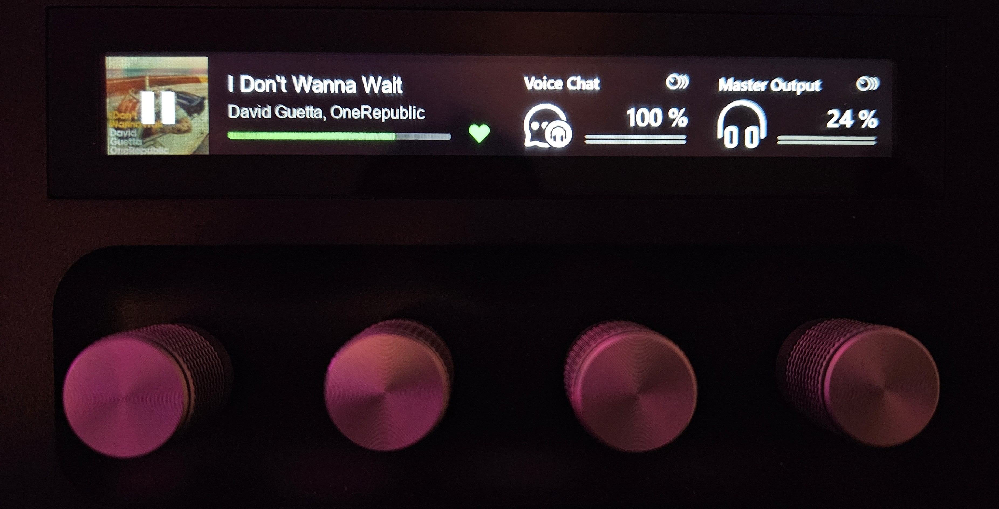
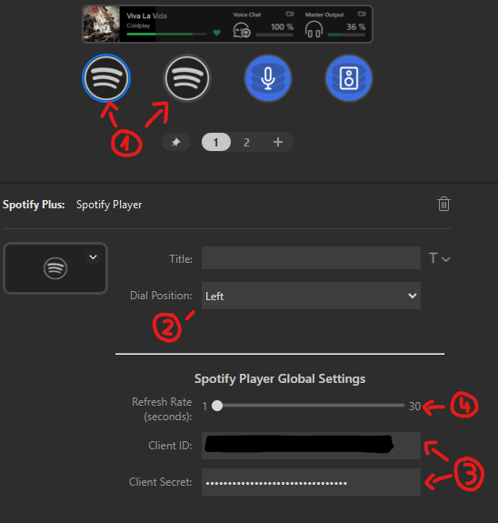

# Spotify Plus Stream Deck Plugin

This is a plugin to display the current Spotify player status on the Stream Deck + touchbar.

## Ilustration




## Features

- Display the current Spotify player status on the Stream Deck + touchbar using 2 dial slots.
- Touch or click on the left dial to play/pause the current song.
- Rotate the left dial to go to the previous/next song.
- Touch or click on the right dial to like/dislike the current song.
- Rotate the right dial to change the spotify player volume (volume via api).

## Installation


To install the plugin, you need to have the Stream Deck software installed.

Next, you need to run the following commands:

```
pnpm add -g @elgato/cli
pnpm run watch
streamdeck link fr.dbenech.spotify-plus.sdPlugin
streamdeck restart fr.dbenech.spotify-plus 

```

Next, restart the Stream Deck software.


## Usage



1. Add 2 spotify player dial next to each other on your Stream Deck.
2. Select the Dial position in the dropdown menu (left or right)
3. Enter your Spotify client ID and client secret in the settings.
   - You can get your client ID and client secret from [here](https://developer.spotify.com/dashboard/applications)
   - "Create an app"
   - Set the redirect uri to `http://localhost:8888/callback`
   - Copy the client ID and client secret into the streamdeck plugin settings
4. (optional) Change the player refresh rate in the settings (Its only the screen refresh rate, not the Spotify api backend refresh rate)
